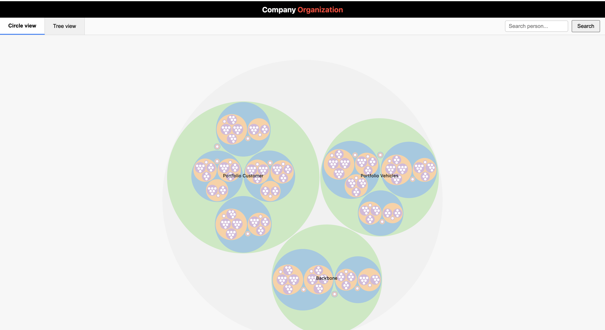
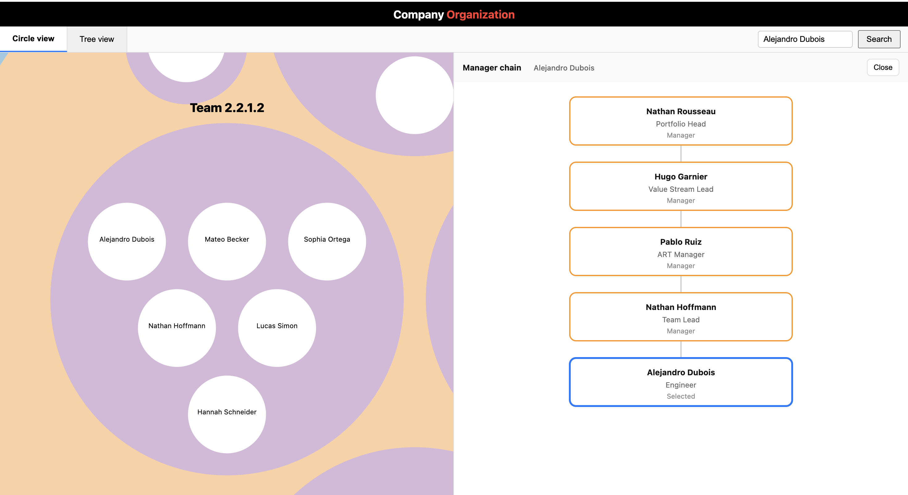

# OrgVisualisation
Interactive D3.js circle-packing visualisation of Porsche Digital org chart, backed by a Python script that converts HR-style employee data into a hierarchy.
This Repository is to explore the feasibility of visualising the Organisation using the Data from Leapsome.

This Interactive org chart provides two synchronized views of the organization:

- **Circle view**: Zoomable circle packing of the whole organization.
- **Tree view**: Collapsible org tree showing reporting lines.

## Features

- **Tabs** to switch between Circle view and Tree view.
- **Search** by person name; highlights the person in both views.
- **Circle view**:
  - Hierarchical circle packing built with `d3.hierarchy` and `d3.pack`.
  - Tooltips on people: name, location, role, manager, portfolio, value stream, product team.
  - Smooth zoom using `d3.interpolateZoom`; clicking a person zooms to their parent circle (e.g. product team), and the circle only occupies about half of the viewport instead of filling the whole screen.
  - Clicking on empty SVG background resets to a padded “full org” view so the outer circle does not touch the window edges.
- **Tree view**:
  - Built with `d3.tree`; nodes are collapsible/expandable.
  - Clicking a person in Circle view highlights them in the Tree view with a thicker blue border.

## Data
The current version is workiking with synthetic data.
In order to generate the synthetic data can be generated by running the following command:

The visualization expects an `employees_hierarchy.json` file with a hierarchical structure and these fields on leaf nodes:

- `userId`
- `name`
- `level` (e.g. `"person"`)
- `role` or `title`
- `location`
- `manager_id`
- `managerEmail`
- `department` (portfolio)
- `valueStream`
- `productTeam`

Non-leaf nodes (company, portfolio, value_stream, art, product_team) must have:

- `name`
- `level` (e.g. `"company"`, `"portfolio"`, `"value_stream"`, `"art"`, `"product_team"`)
- `children`: array of nested nodes

## Usage
### Installation

Check if Python 3 is already installed:

`python3 --version`

If the command is not found or the version is old, install a current Python 3 from https://www.python.org/downloads/mac-osx/.

Go to https://www.python.org/downloads/
* Click “Download Python 3.x” for macOS.
* Open the downloaded `.pkg` file and run through the installer (keep all defaults).
* Open Terminal and check it works:

`python3 --version`

### Generate data
In case if you don't have access to the real data of the employees.
Before opening the HTML file, generate the input JSON from your source data:

`python3 generate_data.py`

This script will generate a json file, following the same structure retrieved from Leapsome.

For data enqueries, contact @Omar Asimi.

### Build the Organisiation Heirarchy Json file

Once you have generated the synthetic data or placed the real data in the project folder, run the following script to build the heirarchy json file.

`python3 build_org_json.py`

<strong>!NOTE:</strong> The original data should be renamed to <strong>emplemployees_raw.json</strong>.

### Run the local server

In order to view the organisation visualisation, first you should run the server, using this script:

`python3 -m http.server 8000`

### View the Organisation Visualisation

Open your browser and go to:

`http://localhost:8000/index.html`.

It will open the following page:

Searching the name of an employee in the search box, will zoom into the Product Team/ ART/ Value Stream/ Portfolio of that employee in the left and show their direct and inderct managers on the righ side. Beloe there is an example how it will look:

